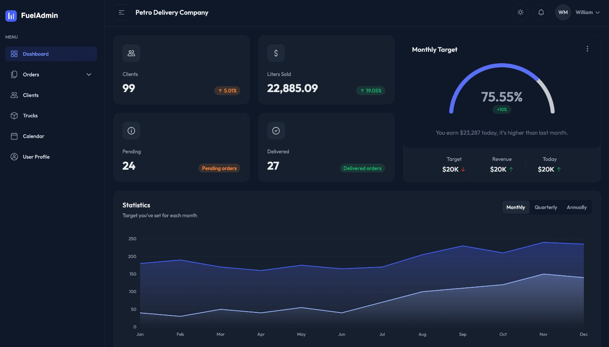

# SaaS Fuel Admin

<p align="center">
	
</p>

Frontend for the SaaS Fuel API built with NextJS for a multi-tenant fuel delivery SaaS platform. Provides a modern and intuitive admin dashboard with
secure authentication, company-scoped data access, and resources for managing clients, orders, trucks, and users.

## 🚀 Getting Started

## Prerequisites

Make sure you have the following installed on your machine:

- **Docker**
- **Docker Compose**
- **Git**


⚠️ **Important**

Before starting, install and run the backend. The complete installation guide for both the backend and frontend is available in the SaaS Fuel API repository:
https://github.com/mmauriciobastos/saas_fuel_api

If you’ve already followed the SaaS Fuel API guide, you should have both the backend and this frontend running. If you only need to set up the frontend, follow the steps below.


### Clone the Frontend Repository

Clone it outside the `saas_fuel_api` folder (or anywhere you prefer):

```
git clone https://github.com/mmauriciobastos/saas_fuel_admin.git
```

### Start the Frontend Application

Navigate to the frontend project and start the containers:

```
cd saas_fuel_admin
docker-compose up -d
```

This will build and run the Next.js Admin Dashboard application.

### Access the Admin Dashboard (frontend)

http://localhost:3000

### Optional:

### Development (Hot Reload) Option

For local iterative development you can mount the source and run the dev server:

```bash
docker run --rm -it -p 3000:3000 -v "$(pwd)":/app -w /app node:20-alpine sh -c "npm ci --legacy-peer-deps && npm run dev"
```

### Image Structure

This repository uses a multi-stage Docker build:

1. deps stage: installs dependencies via `npm ci` using cached layers
2. builder stage: creates a Next.js production build with `output=standalone`
3. runner stage: minimal runtime containing only `.next/standalone`, `.next/static`, and `public/` assets, running as non-root user `nextjs`

### Security / Best Practices Applied

- Non-root user execution
- Standalone output reduces attack surface & image size
- `.dockerignore` keeps build context lean
- Telemetry disabled via `NEXT_TELEMETRY_DISABLED=1`
- Explicit `NODE_ENV=production`

### Troubleshooting

| Issue | Fix |
|-------|-----|
| Asset 404 | Ensure `public/` copied & no basePath misconfig |
| API URL wrong | Set `NEXT_PUBLIC_API_BASE_URL` at runtime |
| Build fails on missing dep | Delete local `node_modules` & retry `npm ci` |
| Memory issues on build | Increase Docker memory to >= 2GB, or set `NODE_OPTIONS=--max_old_space_size=2048` in the Docker build stage |

---


## Components

TailAdmin is a pre-designed starting point for building a web-based dashboard using Next.js and Tailwind CSS. The template includes:

- Sophisticated and accessible sidebar
- Data visualization components
- Profile management and custom 404 page
- Tables and Charts(Line and Bar)
- Authentication forms and input elements
- Alerts, Dropdowns, Modals, Buttons and more
- Can't forget Dark Mode 🕶️

All components are built with React and styled using Tailwind CSS for easy customization.